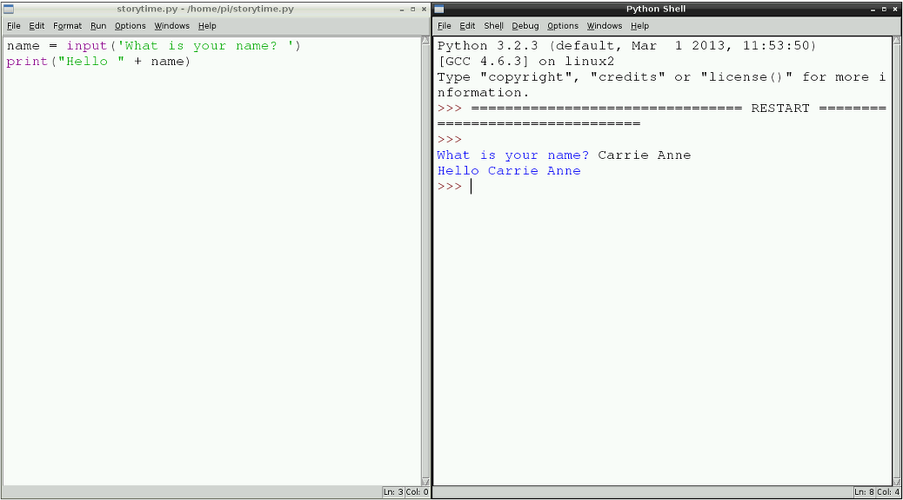

## Get User Input and Print to the Screen

The purpose of the story time program is to generate a story, and print it to the screen so that someone can read it. A good way to start, therefore, is understanding how to use the Python `print` function.

- With your `storytime.py` file open in a text editor window, type the following line:
    
    ```python
    print("Hello reader")
    ```

2. Save the file by clicking on **File** and **Save**. Next, run the program to see what happens. To run a program click on **Run** followed by **Run Module**. You should see the words "Hello reader" appear in the Python Shell window.
    
    **Note**: this tutorial uses Python 3 syntax, so you must be using IDLE3 to run your program.
    
    

3. Now that you can print to the screen, let's find out some information from the person using the program and store it in a variable. At the top of your code type:
    
    ```python
    name = input("What is your name? ")
    print("Hello " + name)
    ```

4. Save the file and run your code to see what happens. Notice that the input question is printed to the screen and then the information entered by the user is stored in the variable 'name'; this is then used in the printed statement saying "Hello".
    
    

5. Can you now create two more variables to store information about what **gender** the user is, and what **day of the week** it is? You will need this information in your final story.