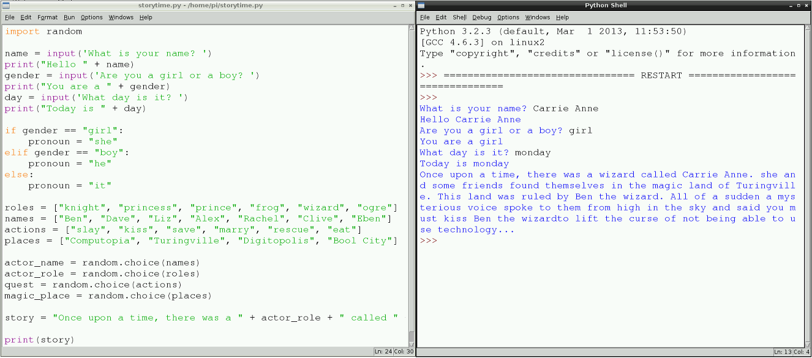

## The Final Print

There is one last line of code you need to write in order for the final randomly generated story to appear on the screen. It was the first Python code you learned in step 1: the print function!


- To print your final story, type:
	
	```python
	print(story)	
	```

	
	
2. You may find that your program does not run first time, most likely due to a typing error. Don't worry; this happens a lot in computer programming. Working out where the error or bug is and fixing it is called **debugging**. 

	When your program does work, you may find that there are spaces missing between the words in the story, or that it is not quite displaying correctly. You can see this in the image above, where a space needs to be added between the words "wizard" and "to". You can simply locate the error, fix it, save the file and run it again.
	
