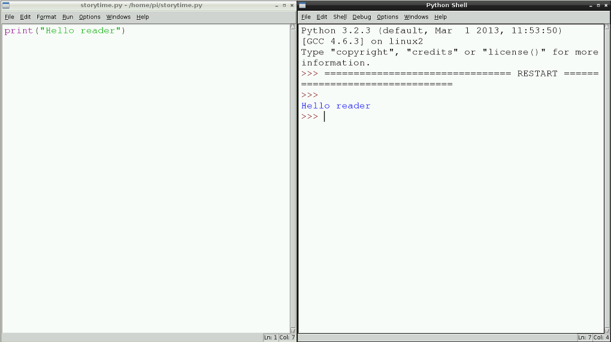

## उपयोगकर्ता इनपुट प्राप्त करें और स्क्रीन पर प्रिंट करें

स्टोरी टाइम कार्यक्रम का उद्देश्य एक कहानी तैयार करना, और इसे स्क्रीन पर प्रिंट करना है ताकि कोई इसे पढ़ सके। इसलिए शुरू करने का एक अच्छा तरीका यह समझना है कि Python `print` (प्रिंट) फंक्शन का उपयोग कैसे करें </0>।

- टेक्स्ट एडिटर विंडो में अपनी `storytime.py` फ़ाइल को खोलकर, निम्नलिखित पंक्ति टाइप करें:
    
    ```python
    print("Hello reader") (हैलो रीडर)
    ```

2. **File** (फ़ाइल) और **Save** (सहेजें) पर क्लिक करके फ़ाइल को सहेजें। इसके बाद, यह देखने के लिए प्रोग्राम चलाएँ कि क्या होता है। प्रोग्राम चलाने के लिए **Run** (चलाएं) पर क्लिक करें और उसके बाद **Run Module** (मॉड्यूल चलाएँ) पर। आपको Python शेल विंडो में "हैलो रीडर" शब्द दिखाई देने चाहिए।
    
    **ध्यान दें**: यह ट्यूटोरियल Python 3 सिंटैक्स का उपयोग करता है, इसलिए आपको अपना प्रोग्राम चलाने के लिए IDLE3 का उपयोग करना होगा।
    
    

3. अब जब आप स्क्रीन पर प्रिंट कर सकते हैं, तो आइए हम इस प्रोग्राम का उपयोग करने वाले व्यक्ति से कुछ जानकारी प्राप्त करें और इसे एक वेरिएबल में संगृहीत करें। अपने कोड के शीर्ष पर टाइप करें:
    
    ```python
    name = input("What is your name? ")
    print("Hello " + name)
    ```

4. क्या होता है यह देखने के लिए अपनी फ़ाइल सहेजें और अपना कोड चलाएँ। ध्यान दें कि इनपुट प्रश्न स्क्रीन पर मुद्रित होता है और फिर उपयोगकर्ता द्वारा दर्ज की गई जानकारी वेरिएबल 'note' (नाम) में संगृहीत होती है; इसके बाद इसका उपयोग "Hello" (हैलो) कहने वाले मुद्रित कथन में किया जाता है।
    
    

5. क्या अब आप उपयोगकर्ता का **लिंग** क्या है, और यह **सप्ताह का कौन सा दिन** है के बारे में जानकारी संगृहीत करने के लिए दो और वेरिएबल बना सकते हैं? आपको अपनी अंतिम कहानी में इस जानकारी की आवश्यकता होगी।