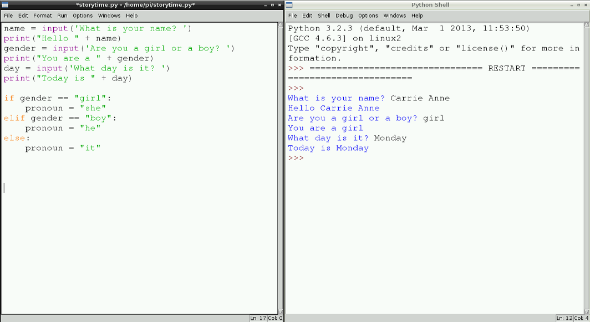

## If (यदि), Elif (अन्यथा यदि), और Else (अन्यथा)

उपयोगकर्ता के लिंग का पता चलने के बाद, आप उस जानकारी का उपयोग अपनी कहानी में कर सकते हैं। But as you know from your literacy lessons, nouns are preceded with 'he and 'she' and not 'girl' or 'boy', which are the values currently stored in the `gender` variable. आप यहाँ मदद करने के लिए एक कंप्यूटिंग अवधारणा का उपयोग कर इसे ठीक कर सकते हैं; इसे **सशर्त कहा जाता है**।

- `input` (इनपुट) और `print` (प्रिंट) कथनों के नीचे टाइप करें:
    
    ```python
    if gender == "girl":
        pronoun = "she"
    ```
    
    कोड की ये दो पंक्तियां बताती हैं कि *यदि* 'आप लड़की हैं या लड़का?' प्रश्न का उत्तर 'लड़की' है, तो सर्वनाम को 'she' (वह) के लिए सेट करें। यह एक शर्त है।

2. यदि प्रश्न का उत्तर 'लड़का' है तो अब आपको सर्वनाम सेट करने की आवश्यकता है:
    
    ```python
    elif gender == "boy":
        pronoun = "he"
    ```
    
    `elif` का अर्थ है 'अन्यथा, यदि'.

3. लेकिन यदि उपयोगकर्ता 'लड़की' या 'लड़का' टाइप नहीं करता है तो क्या होगा? खैर, आप इस स्थिति को यह टाइप करके संभाल सकते हैं:
    
    ```python
    अन्यथा:
        pronoun = "it"
    ```

4. अपने काम को **फ़ाइल** और**सहेजें** पर क्लिक करके सहेजें।
    
    