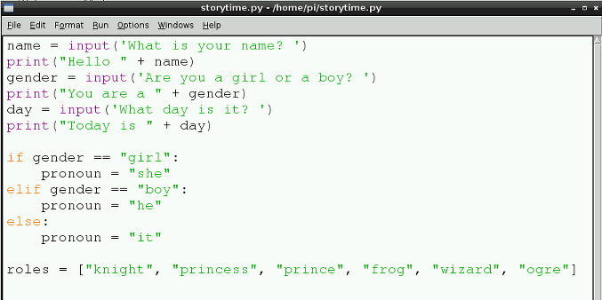

## सूचियाँ

इस प्रोग्राम द्वारा तैयार की गई आपकी अधिकांश कहानी यादृच्छिक होगी। यह मज़े के लिए अच्छा है। अब आपको अलग-अलग और मनोरंजक शब्दों को संगृहीत करने के लिए कुछ सूचियाँ बनाने की आवश्यकता है जिनका उपयोग आपके अंतिम स्टोरी प्रोग्राम में किया जा सकता है।

सूचियों का नामकरण वेरिएबलों की तरह ही किया जा सकता है; उदाहरण के लिए, `number = [1, 2, 3, 4]`। 'नंबर' नामक इस सूची में चार आइटम हैं।

- आपने अपने स्टोरी टाइम प्रोग्राम में कोड की जो अंतिम पंक्ति लिखी है उसके नीचे, एक पंक्ति खाली छोड़ दें और फिर टाइप करें:
    
    ```python
    names = ["Ben", "Dave", "Liz", "Alex", "Rachel", "Clive", "Eben"]
    ```
    
    यह विभिन्न नामों की एक सूची है। आप उद्धरण चिह्नों में दिए गए नामों को बदल सकते हैं, और उनके बदले अपने मित्रों के नाम या छद्म नाम लिख सकते हैं।

2. इस तरह स्थानों, कार्यों, और भूमिकाओं के लिए और सूचियाँ बनाएँ:
    
    ```python
    roles = ["knight", "princess", "prince", "frog", "wizard", "ogre"]
    ```
    
    