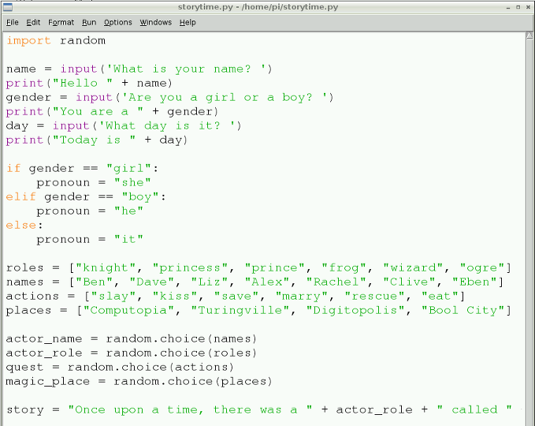

## कहानी का समय!

बढ़िया, आपने इसे मजेदार हिस्सा बना दिया है। यह वह जगह है जहाँ आप अपनी पूरी कड़ी मेहनत को एक कहानी में पिरो देते हैं। यहाँ आप कल्पनाशील और रचनात्मक हो सकते हैं क्योंकि आप इस सब को एक साथ लाना चाहते हैं।

- प्रोग्राम का यह पूरा हिस्सा एक पंक्ति पर लिखा जाएगा। `story =` (कहानी) टाइप करके अपनी कहानी को संगृहीत करने के लिए एक वेरिएबल बनाकर शुरू करें।

2. फिर उसी पंक्ति पर, `"` के साथ एक उद्धरण खोलें।

3. उसके बाद, अपनी कहानी की आरंभ टाइप करें, उदाहरण के लिए `Once upon a time, there was a` (एक समय की बात है कि एक था।

4. एक जगह छोड़ दें और फिर अपने उद्धरण चिह्न `"` को बंद कर दें।

5. अब आप `+ player_role +` टाइप करके एक यादृच्छिक खिलाड़ी की भूमिका जोड़ सकते हैं।

6. फिर उद्धरण चिह्न `" called "` (नामक) खोलकर, अपनी कहानी टाइप करने के लिए वापस आएँ।

7. कहानी को और अधिक लिखने से पहले उपयोगकर्ता का नाम `+ name +` जोड़ें।

8. जब तक आप इस तरह के अपने सभी वेरिएबल का उपयोग नहीं कर लेते हैं तब तक जारी रखें:
    
    ```python
    story = "Once upon a time, there was a " + actor_role + " called " + name + ". " + pronoun + " and some friends found themselves in the magic land of " + magic_place + ". This land was ruled by " + actor_name + " the " + actor_role + ". All of a sudden a mysterious voice spoke to them from high in the sky and said you must " + quest + " " + actor_name + " the " + actor_role + " to lift the curse of not being able to use technology... "
    ```
    
    याद रखें कि इस सब को एक पंक्ति पर टाइप किया जाना चाहिए! अपनी वाक्य में भी अपने सर्वनाम वेरिएबल का उपयोग करना न भूलें!
    
    