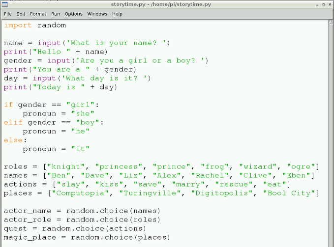

## Using Random

With lists of actions, places, names, and roles you can write some code that will randomly pick one item from each list. This will help to generate your story, and should make it quirky!

- Go to the top of your program, above all the lines of code you have already written. At the top type `import random`. This imports the `random` module.

2. Then go to the bottom of your code, and underneath your lists type:
    
    ```python
    actor_name = random.choice(names)
    ```
    
    