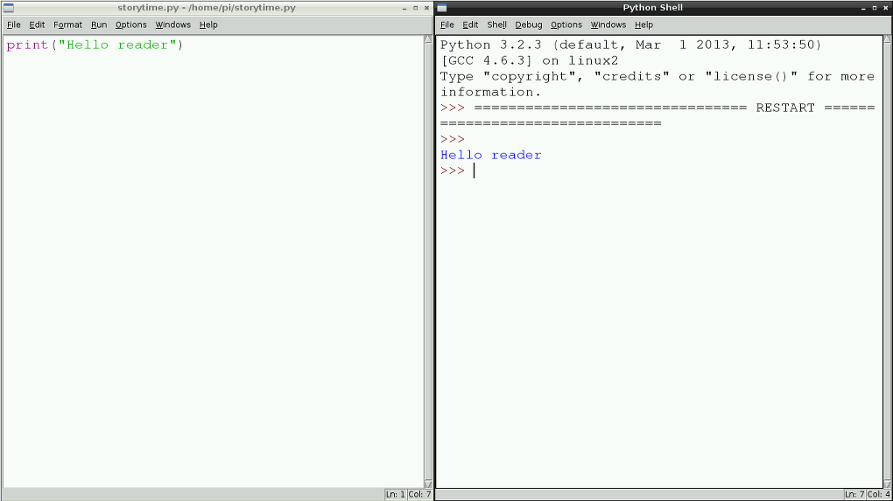
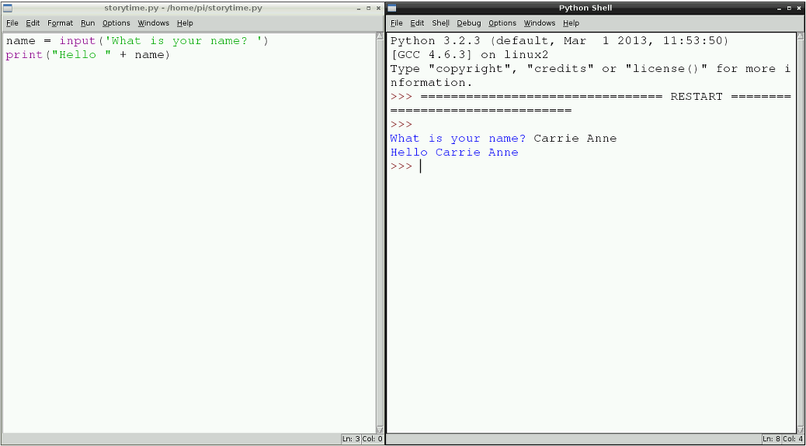
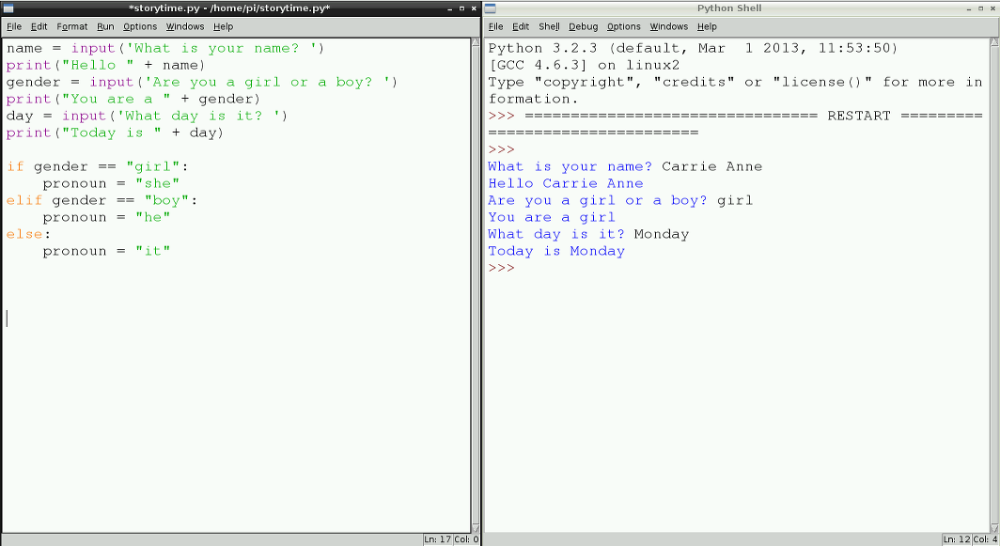
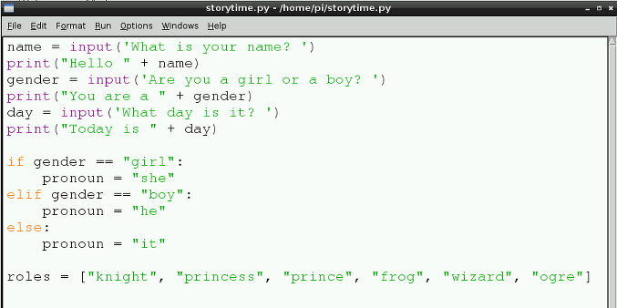
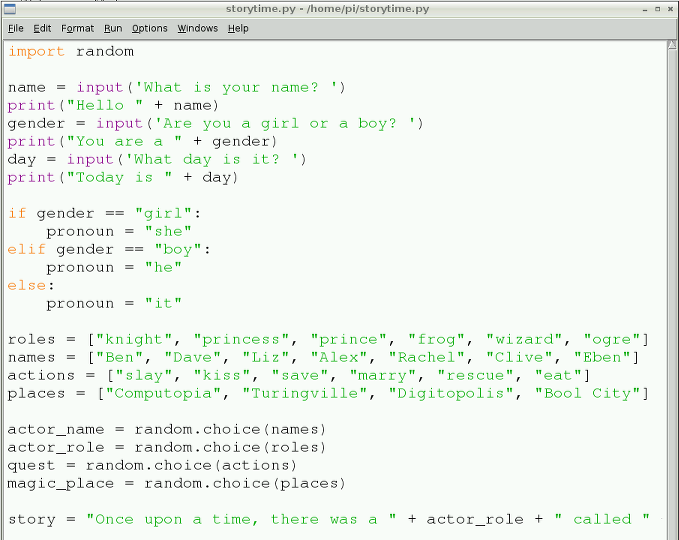
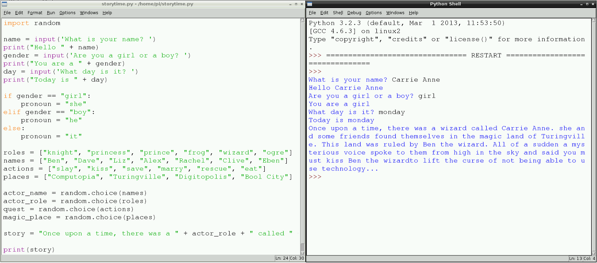

# Storytime

Let's write a random interactive story with Python.

## Using IDLE on Raspberry Pi

A great way to write your code and test it in intervals is to use IDLE, a development application for Python. You will be writing your code in Python 3.

1. Load **IDLE3** by clicking on the **Main Menu** followed by **Programming** and then selecting **Python 3**.

2. Once the Python Shell window has loaded, click on **File** and **New Window**. This will open a text editor window in which you can write, save and test your code.

3. Save the blank file as `storytime.py` by clicking on **File** and **Save As**.

## Using Trinket

If you do not have a Raspberry Pi then you can write your code and test it in intervals using Trinket in a browser window.  

1. Open the blank Python template Trinket: [jumpto.cc/python-new](jumpto.cc/python-new).
1. Follow the instructions in this activity and type your code into the Python template trinket.
1. To save your work, click the down arrow and then click ‘Link’. This will give you a link that you can save and come back to later. You’ll need to do this every time you make changes, as the link will change!
	
## Get User Input and Print to the Screen

The purpose of the story time program is to generate a story, and print it to the screen so that someone can read it. A good way to start, therefore, is understanding how to use the Python `print` function.

1. With your `storytime.py` file open in a text editor window, type the following line:
	
	```python
	print("Hello reader")
	```
	
2. Save the file by clicking on **File** and **Save**. Next, run the program to see what happens. To run a program click on **Run** followed by **Run Module**. You should see the words "Hello reader" appear in the Python Shell window. 

	**Note**: this tutorial uses Python 3 syntax, so you must be using IDLE3 to run your program.

	

3. Now that you can print to the screen, let's find out some information from the person using the program and store it in a variable. At the top of your code type:

	```python
	name = input("What is your name? ")
	print("Hello " + name)
	```

4. Save the file and run your code to see what happens. Notice that the input question is printed to the screen and then the information entered by the user is stored in the variable 'name'; this is then used in the printed statement saying "Hello".	 

	
	
5. Can you now create two more variables to store information about what **gender** the user is, and what **day of the week** it is? You will need this information in your final story.


## If, Elif, and Else

Having discovered the gender of the user, you can use that information in your story. But as you know from your literacy lessons, nouns are preceded with 'he and 'she' and not 'girl' or 'boy', which are the values currently stored in the `gender` variable. You can fix this by using a computing concept to help out here; it's called a **conditional**.

1. Underneath the `input` and `print` statements type:

	```python
	if gender == "girl":
	    pronoun = "she"
	```
	These two lines of code state that *if* the answer to the question 'Are you a girl or boy?' is 'girl', then set the pronoun to be 'she'. This is a condition. 
		
2. Now you need to set the pronoun if the answer to the question is 'boy':
	
	```python
	elif gender == "boy":
	    pronoun = "he"
	```
	`elif` means 'else, if'. 
	
3. But what if the user doesn't type 'girl' or 'boy'? Well, you can cover this situation by typing:	
	```python        
	else:
	    pronoun = "it"
	```    
4. Save your work so far by clicking on **File** and **Save**.
	
	
	

## Lists

Much of your story that is generated by this program will be random. That's part of the fun. Now you need to create some lists to store different and amusing words that can be used in your final story program. 

Lists can be named in much the same way as variables; for example, `number = [1, 2, 3, 4]`. This list called 'number' has four items in it. 

1. Underneath the last line of code you have written in your story time program, leave a line blank and then type:

	```python
	names = ["Ben", "Dave", "Liz", "Alex", "Rachel", "Clive", "Eben"]
	```
	
	This is a list of different names. You can change the names between the quotation marks, and replace them with names of your friends or made-up names. 
	
2. Create more lists for places, actions, and roles like this:

	```python
	roles = ["knight", "princess", "prince", "frog", "wizard", "ogre"]
	```
	
	
	
		
## Using Random

With lists of actions, places, names, and roles you can write some code that will randomly pick one item from each list. This will help to generate your story, and should make it quirky!


1. Go to the top of your program, above all the lines of code you have already written. At the top type `import random`. This imports the `random` module.

2. Then go to the bottom of your code, and underneath your lists type:

	```python
	actor_name = random.choice(names)
	```
	
	

## Story Time!

Great, you have made it to the fun part. Here is where you get to piece all your hard work together into a story. Here you can be as imaginative and creative as you like bringing it all together.

1. This part of the program will be written all on one line. Begin by creating a variable to store your story in by typing `story =`.

2. Then on the same line, open a quotation with `"`.

3. Next, type the start of your story, for example `Once upon a time, there was a`.

4. Leave a space and then close your quotation marks `"`. 

5. Now you can add a random player role by typing `+ player_role +`.

6. Then return to typing your story, by opening quotation marks `" called "`.

7. Add the user's name ` + name +` before writing more of the story.

8. Continue until you have used all your variables like this:

	```python
	story = "Once upon a time, there was a " + actor_role + " called " + name + ". " + pronoun + " and some friends found themselves in the magic land of " + magic_place + ". This land was ruled by " + actor_name + " the " + actor_role + ". All of a sudden a mysterious voice spoke to them from high in the sky and said you must " + quest + " " + actor_name + " the " + actor_role + " to lift the curse of not being able to use technology... "
	```
	
	Remember this should be typed all on one line! Don't forget to use your pronoun variable in your sentence too!
	
	

## The Final Print

There is one last line of code you need to write in order for the final randomly generated story to appear on the screen. It was the first Python code you learned in step 1: the print function!


1. To print your final story, type:
	
	```python
	print(story)	
	```

	
	
2. You may find that your program does not run first time, most likely due to a typing error. Don't worry; this happens a lot in computer programming. Working out where the error or bug is and fixing it is called **debugging**. 

	When your program does work, you may find that there are spaces missing between the words in the story, or that it is not quite displaying correctly. You can see this in the image above, where a space needs to be added between the words "wizard" and "to". You can simply locate the error, fix it, save the file and run it again.
	
## What next?

- Can you create another story using the same techniques?
- Can you connect an LCD screen to your Raspberry Pi GPIO pins to display the story?
- Can you think of a way to add even more randomisation to your story?
