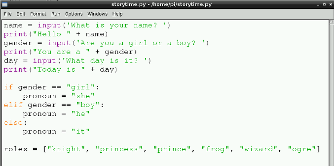

## Lists

Much of your story that is generated by this program will be random. That's part of the fun. Now you need to create some lists to store different and amusing words that can be used in your final story program.

Lists can be named in much the same way as variables; for example, `number = [1, 2, 3, 4]`. This list called 'number' has four items in it.

- Underneath the last line of code you have written in your story time program, leave a line blank and then type:
    
    ```python
    names = ["Ben", "Dave", "Liz", "Alex", "Rachel", "Clive", "Eben"]
    ```
    
    This is a list of different names. You can change the names between the quotation marks, and replace them with names of your friends or made-up names.

2. Create more lists for places, actions, and roles like this:
    
    ```python
    roles = ["knight", "princess", "prince", "frog", "wizard", "ogre"]
    ```
    
    